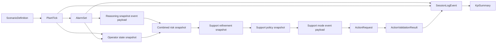

# AURA-IDCR Core Module And Data Contracts

This document defines the Phase 0 contract package that later build slices must share.
The goal is to preserve one deterministic closed loop:

`plant state -> alarms -> reasoning -> adaptive support -> action validation -> logging/evaluation`

## Contract Design Rules

- Contract keys use lower snake case unless an enum value is explicitly uppercase.
- All contracts must be serializable to JSON for logging and replay.
- Runtime modules may hold richer internal state, but they must publish the contract surfaces defined here.
- Scenario, alarm, KPI, and HMI docs in `docs/` all assume these names and enums.

## Shared Enums

```ts
type SessionMode = "baseline" | "adaptive"
type AlarmPriority = "P1" | "P2" | "P3"
type ValidationOutcome = "pass" | "soft_warning" | "hard_prevent"
type ActorRole = "operator" | "shift_supervisor" | "trainer_evaluator" | "system"
type SourceModule =
  | "scenario_engine"
  | "plant_twin"
  | "alarm_intelligence"
  | "reasoning_layer"
  | "adaptive_orchestrator"
  | "action_validator"
  | "hmi"
  | "evaluation"
type SupportMode = "monitoring_support" | "guided_support" | "protected_response"
```

## Supporting Types

```ts
type ScalarValue = number | boolean | string
type PlantStateSnapshot = Record<string, ScalarValue>

type AlarmRecord = {
  alarm_id: string
  title: string
  priority: AlarmPriority
  subsystem_tag: string
  active: boolean
  visibility_rule: "always_visible" | "standard_visible"
  group_hint: string
}

type TraceRef = {
  ref_type: "tick_id" | "action_id" | "alarm_id" | "phase_id"
  ref_value: string
}
```

## `PlantTick`

`PlantTick` is the canonical published plant-state payload for each simulation step.

```ts
type PlantTick = {
  tick_id: string
  session_id: string
  scenario_id: string
  session_mode: SessionMode
  sim_time_sec: number
  phase_id: string
  plant_state: PlantStateSnapshot
  derived_state: {
    alarm_load_count: number
    active_alarm_cluster_count: number
  }
  last_action_request_id?: string
  source_event_ids: string[]
}
```

Required notes:

- `plant_state` must include every canonical variable from [aura_variable_schema.md](./aura_variable_schema.md).
- `derived_state` mirrors the alarm burden values for quick downstream access and should stay numerically consistent with the corresponding canonical keys in `plant_state`.
- `tick_id` is the anchor key for replay, alarm snapshots, and reasoning traces.

## `AlarmSet`

`AlarmSet` is the authoritative alarm snapshot derived from a `PlantTick`.

```ts
type AlarmSet = {
  alarm_set_id: string
  tick_id: string
  session_id: string
  scenario_id: string
  active_alarm_count: number
  active_alarm_cluster_count: number
  highest_priority_active?: AlarmPriority
  active_alarm_ids: string[]
  active_alarms: AlarmRecord[]
  newly_raised_alarm_ids: string[]
  newly_cleared_alarm_ids: string[]
}
```

Required notes:

- `active_alarms` must use dictionary metadata from [aura_alarm_dictionary.md](./aura_alarm_dictionary.md).
- `active_alarm_ids` exists so log events and KPI code can depend on stable IDs without re-serializing whole alarm records.
- `active_alarm_cluster_count` may remain a simple hinted count in Phase 1 and become smarter in Phase 2.

## `ScenarioDefinition`

`ScenarioDefinition` is the loadable scenario contract used by the scenario engine.

```ts
type ScenarioDefinition = {
  scenario_id: string
  version: string
  title: string
  summary: string
  training_goal: string
  initiating_event: string
  difficulty: "intro" | "moderate" | "high"
  tags: string[]
  expected_duration_sec: number
  deterministic_seed: string
  initial_plant_state: PlantStateSnapshot
  phases: ScenarioPhase[]
  event_injections: ScenarioEventInjection[]
  alarm_hooks: AlarmTriggerHook[]
  allowed_operator_actions: AllowedOperatorAction[]
  success_condition: ScenarioCondition
  failure_condition: ScenarioCondition
  timeout_condition: ScenarioCondition
}
```

The nested shapes for `ScenarioPhase`, `ScenarioEventInjection`, `AlarmTriggerHook`, `AllowedOperatorAction`, `ScenarioTrigger`, `ScenarioStateEffect`, and `ScenarioCondition` are defined in [aura_scenario_schema.md](./aura_scenario_schema.md).

## `ActionRequest`

`ActionRequest` is the single input contract for operator or supervisor commands that may affect plant progression.

```ts
type ActionRequest = {
  action_request_id: string
  session_id: string
  scenario_id: string
  sim_time_sec: number
  actor_role: ActorRole
  action_id: string
  target_subsystem: string
  requested_value?: ScalarValue
  ui_region: "plant_mimic" | "alarm_area" | "procedure_lane" | "supervisor_panel"
  reason_note?: string
}
```

Required notes:

- `action_id` must correspond to an `allowed_operator_actions` entry in the active scenario.
- `ui_region` makes later replay and UX analysis possible without additional instrumentation.

## `ActionValidationResult`

`ActionValidationResult` is the bounded response from the validator/interceptor.

```ts
type ActionValidationResult = {
  validation_result_id: string
  action_request_id: string
  sim_time_sec: number
  outcome: ValidationOutcome
  requires_confirmation: boolean
  override_allowed: boolean
  reason_code: string
  explanation: string
  affected_variable_ids: string[]
  prevented_harm?: boolean
  nuisance_flag?: boolean
  recommended_safe_alternative?: string
}
```

Required notes:

- `pass` means proceed without friction.
- `soft_warning` means require explicit acknowledgement before applying the action.
- `hard_prevent` means block unless a later supervisory override path explicitly exists.
- `prevented_harm` and `nuisance_flag` are optional evaluation-facing fields that later logging may carry forward for KPI computation.

## `SessionLogEvent`

`SessionLogEvent` is the canonical append-only event used for replay, KPI computation, and auditability.

```ts
type SessionLogEvent = {
  event_id: string
  session_id: string
  scenario_id: string
  sim_time_sec: number
  event_type: SessionLogEventType
  source_module: SourceModule
  phase_id?: string
  payload: Record<string, unknown>
  trace_refs: TraceRef[]
}
```

### Required Event Types

```ts
type SessionLogEventType =
  | "session_started"
  | "phase_changed"
  | "plant_tick_recorded"
  | "alarm_set_updated"
  | "reasoning_snapshot_published"
  | "support_mode_changed"
  | "operator_state_snapshot_recorded"
  | "action_requested"
  | "action_validated"
  | "action_confirmation_recorded"
  | "operator_action_applied"
  | "diagnosis_committed"
  | "scenario_outcome_recorded"
  | "kpi_summary_generated"
```

Required notes:

- `payload` must stay shallow and explicit enough for replay tooling to inspect without custom parsers.
- `trace_refs` must point back to the tick, phase, action, and alarm objects that justify the event.
- `diagnosis_committed` is the event that later KPI calculation uses for first confirmed diagnosis timing.
- Minimum KPI-facing payload fields for these event types are defined in [aura_kpi_definitions.md](./aura_kpi_definitions.md) and are part of the expected contract surface.
- Phase 3 may extend `operator_state_snapshot_recorded` with additive fields such as `degraded_mode_active`, `degraded_mode_reason`, and `observation_window_ticks`.
- Phase 3 may extend `reasoning_snapshot_published` with additive combined-risk fields such as `combined_risk_score`, `combined_risk_band`, `top_contributing_factors`, and `confidence_caveat`.
- Phase 3 support refinement may add shallow fields such as `current_support_focus`, `emphasized_lane_item_ids`, `summary_explanation`, `watch_now_summary`, `degraded_confidence_caution`, and `wording_style` without replacing the base reasoning payload.
- Phase 4 assistance policy may add shallow fields such as `support_mode`, `current_mode_reason`, `transition_reason`, `mode_change_summary`, `support_behavior_changes`, `degraded_confidence_effect`, and compact critical-visibility summaries without replacing the base reasoning payload.
- Phase 4 action validation may add shallow `action_validated` fields such as `explanation`, `risk_context`, `confidence_note`, and `recommended_safe_alternative`, plus the additive `action_confirmation_recorded` event for explicit soft-warning confirmation logging.

## `PendingActionConfirmation`

`PendingActionConfirmation` is the compact session-facing state published when a soft warning is waiting for explicit operator confirmation.

```ts
type PendingActionConfirmation = {
  action_request: ActionRequest
  validation_result: ActionValidationResult
}
```

Required notes:

- This state exists only while a `soft_warning` is awaiting confirmation.
- It is additive session state for HMI flow control and replay inspection, not a replacement for canonical log events.

## `KpiSummary`

`KpiSummary` is the exported session-level metric bundle for baseline versus adaptive comparison.

```ts
type KpiSummary = {
  kpi_summary_id: string
  session_id: string
  scenario_id: string
  session_mode: SessionMode
  generated_at_iso: string
  completeness: "partial" | "complete"
  metrics: KpiMetric[]
}

type KpiMetric = {
  kpi_id: string
  label: string
  value: number
  unit: string
  audience: "internal_only" | "demo_facing"
  dependency_event_types: SessionLogEventType[]
}
```

## `OperatorStateSnapshot`

`OperatorStateSnapshot` is the compact deterministic operator-state proxy published from existing runtime/session signals only.

```ts
type OperatorStateSnapshot = {
  workload_index: number
  attention_stability_index: number
  signal_confidence: number
  degraded_mode_active: boolean
  degraded_mode_reason: string
  observation_window_ticks: number
}
```

Required notes:

- These are bounded proxy outputs for a student-feasible prototype, not biometric or medical measurements.
- Inputs must come only from existing runtime/session signals already available in the deterministic loop.
- `signal_confidence` must fail gracefully and make degraded mode explicit rather than silent.

## `CombinedRiskSnapshot`

`CombinedRiskSnapshot` is the additive transparent risk layer published alongside the existing Phase 2 reasoning outputs.

```ts
type CombinedRiskBand = "low" | "guarded" | "elevated" | "high"

type CombinedRiskFactor = {
  factor_id:
    | "plant_severity"
    | "alarm_burden"
    | "diagnosis_uncertainty"
    | "operator_workload"
    | "attention_instability"
    | "signal_confidence_penalty"
  label: string
  raw_index: number
  contribution: number
  detail: string
}

type CombinedRiskSnapshot = {
  combined_risk_score: number
  combined_risk_band: CombinedRiskBand
  factor_breakdown: CombinedRiskFactor[]
  top_contributing_factors: string[]
  confidence_caveat: string
  why_risk_is_current: string
  what_changed: string
}
```

Required notes:

- This layer is additive and must not replace the Phase 2 ranked root-cause / storyline outputs.
- `factor_breakdown` must stay inspectable enough for replay, regression tests, and judge-facing explanation.
- The confidence caveat must reflect operator-state signal confidence or degraded-mode penalties when active.

## `SupportRefinementSnapshot`

`SupportRefinementSnapshot` is the additive deterministic support-refinement layer that republishes Phase 2 support content with bounded emphasis cues.

```ts
type SupportUrgencyLevel = "standard" | "priority" | "urgent"
type SupportWordingStyle = "concise" | "explicit"

type FirstResponsePresentationCue = {
  emphasized: boolean
  urgency_level: SupportUrgencyLevel
  why_this_matters_now: string
  attention_sensitive_caution?: string
  degraded_confidence_caveat?: string
  wording_style: SupportWordingStyle
}

type SupportRefinementSnapshot = {
  current_support_focus: string
  emphasized_lane_item_ids: string[]
  summary_explanation: string
  operator_context_note: string
  degraded_confidence_caution: string
  watch_now_summary: string
  wording_style: SupportWordingStyle
}
```

Required notes:

- This layer is additive and must not replace the Phase 2 storyline, ranked root-cause output, or first-response lane base logic.
- `current_support_focus`, `summary_explanation`, and `watch_now_summary` must stay short, deterministic, and replay-inspectable.
- `FirstResponsePresentationCue` is presentation metadata only; it may reprioritize emphasis, but it must not hide or remove existing first-response items.

## `CriticalVisibilityGuardrailState`

`CriticalVisibilityGuardrailState` is the compact published state that proves critical plant cues and critical alarms remain pinned across assistance modes.

```ts
type CriticalVisibilityGuardrailState = {
  critical_variable_ids: string[]
  always_visible_alarm_ids: string[]
  pinned_alarm_ids: string[]
  summary: string
}
```

Required notes:

- `critical_variable_ids` must align with the continuously visible plant-state baseline defined in [aura_hmi_wireframe.md](./aura_hmi_wireframe.md).
- `pinned_alarm_ids` must keep all active `always_visible` alarms and the active `P1` / `P2` picture continuously surfaced somewhere in the operator shell.

## `SupportPolicySnapshot`

`SupportPolicySnapshot` is the additive deterministic assistance-policy layer published alongside support refinement.

```ts
type SupportPolicySnapshot = {
  current_mode_reason: string
  transition_reason: string
  mode_change_summary: string
  support_behavior_changes: string[]
  degraded_confidence_effect: string
  critical_visibility: CriticalVisibilityGuardrailState
}
```

Required notes:

- This layer must stay deterministic, compact, and replay-inspectable.
- It may explain how `SupportMode` is affecting emphasis strength, wording, watch-now prioritization, first-response focus intensity, and caution prominence, but it must not redesign the shell or hide major regions.
- Degraded confidence must reduce certainty/aggressiveness explicitly rather than silently.

## Closed-Loop Contract Map



## Phase 1 Usage Rules

- Phase 1 should implement `PlantTick`, `ScenarioDefinition`, `ActionRequest`, and `SessionLogEvent` first, then layer `AlarmSet` on top.
- Even before reasoning or adaptive support exists, `SessionLogEvent` must already use the canonical `event_type` enum so later KPI work remains compatible.
- Future phases may add fields, but they should not rename or repurpose the Phase 0 keys defined here.
