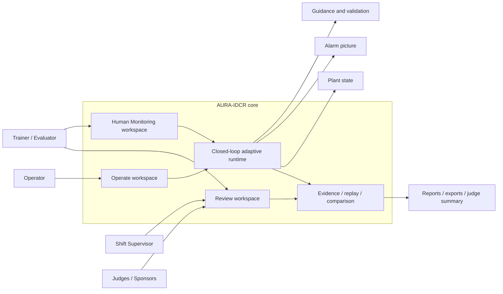
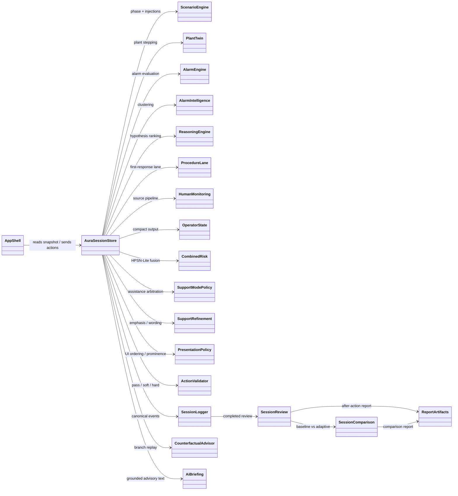
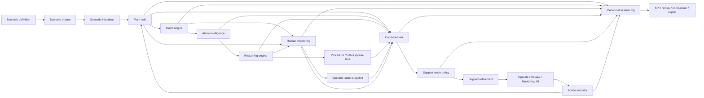
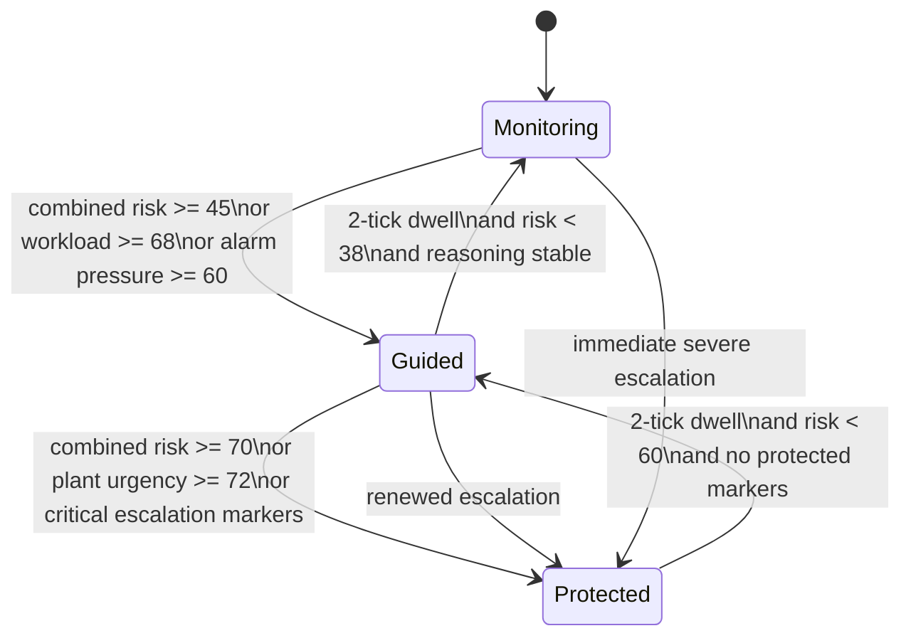
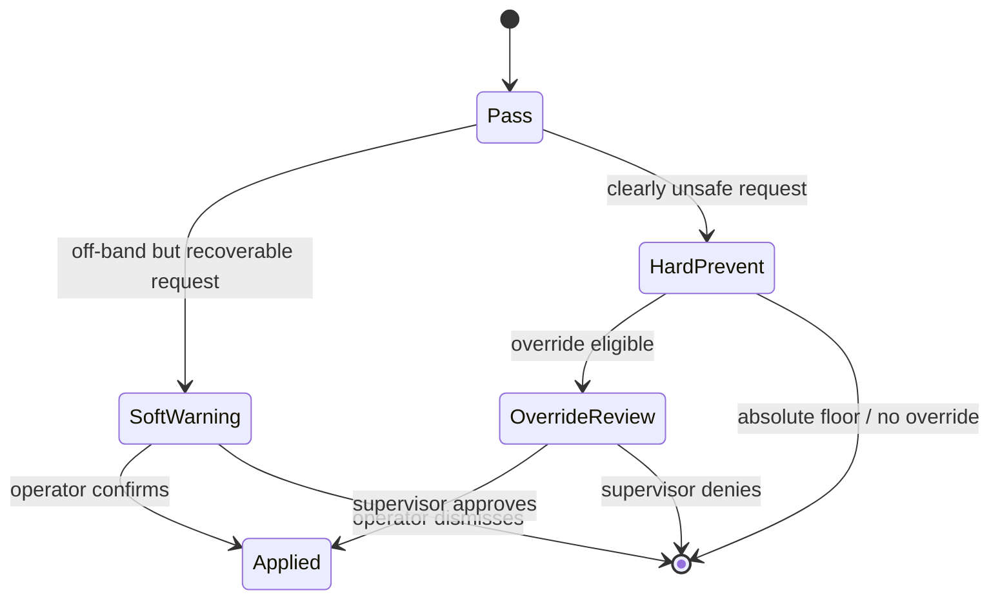
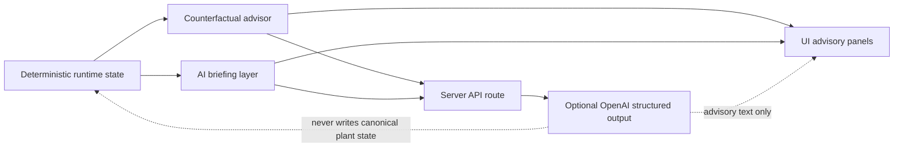
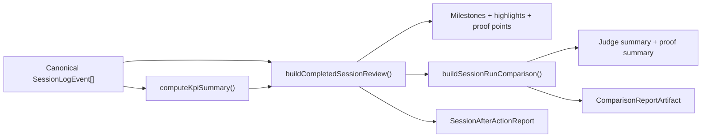

# AURA-IDCR Visual System Defense Dossier

This document is a defense-ready system explainer for AURA-IDCR:

- what the system is
- how the code is organized
- how the logic flows at runtime
- what equations and heuristics the prototype actually uses
- why the design choices are technically defensible
- how to answer likely STEM-facing questions honestly

It is grounded in the current repository implementation, especially:

- `src/state/sessionStore.ts`
- `src/runtime/plantTwin.ts`
- `src/runtime/alarmEngine.ts`
- `src/runtime/alarmIntelligence.ts`
- `src/runtime/reasoningEngine.ts`
- `src/runtime/humanMonitoring.ts`
- `src/runtime/combinedRisk.ts`
- `src/runtime/supportModePolicy.ts`
- `src/runtime/actionValidator.ts`
- `src/runtime/kpiSummary.ts`
- `src/runtime/counterfactualAdvisor.ts`
- `src/runtime/sessionReview.ts`
- `src/runtime/sessionComparison.ts`
- `src/ui/OperateWorkspace.tsx`
- `src/ui/ReviewWorkspace.tsx`
- `src/ui/HumanMonitoringWorkspace.tsx`

---

## 1. System claim and boundaries

### 1.1 Core claim

AURA-IDCR is a BWRX-300-inspired adaptive digital control room prototype for abnormal-event decision support.

Its central engineering claim is:

> If plant state, alarm burden, procedure context, and operator-state proxies are interpreted together, then the interface can adapt in a transparent and safety-bounded way that improves diagnosis, reduces overload, guides first response, and lowers harmful action risk.

### 1.2 What it is not

This is intentionally **not**:

- a real reactor control system
- a licensing-grade plant model
- an autonomous plant-control AI
- a medical or biometric human-monitoring system
- a chatbot pretending to operate the plant

That honesty matters during defense. The system is strongest when presented as a transparent, student-feasible, deterministic socio-technical prototype.

---

## 2. System context visual



### 2.1 Human roles

| Role | Main purpose |
| --- | --- |
| Operator | Runs the scenario and applies bounded actions |
| Shift Supervisor | Approves bounded override when a hard prevent is override-eligible |
| Trainer / Evaluator | Compares baseline vs adaptive runs, inspects KPIs and replay |
| Judges / Sponsors | Consume the proof story, comparison outputs, and design rationale |

---

## 3. UML-style architecture map



### 3.1 Architectural reading

- `AuraSessionStore` is the orchestration hub.
- The runtime core is modular and mostly pure/deterministic.
- Logging is not an afterthought; it is part of the architecture.
- Review, comparison, and export are derived from canonical events rather than ad hoc UI state.
- Optional AI features sit on top of deterministic state instead of replacing it.

---

## 4. Closed-loop runtime logic



### 4.1 The loop in one sentence

Every tick, the system recomputes plant state, alarm state, reasoning state, human-monitoring state, fused risk, adaptive support posture, and validation posture, then logs the whole picture for replay and evaluation.

---

## 5. Tick sequence diagram

```mermaid
sequenceDiagram
  participant User as Operator / UI
  participant Store as AuraSessionStore
  participant Scenario as ScenarioEngine
  participant Twin as PlantTwin
  participant Alarm as AlarmEngine
  participant Reason as Reasoning+Lane
  participant HM as HumanMonitoring
  participant Risk as Risk+SupportPolicy
  participant Log as SessionLogger

  loop Every tick (default dt = 5 s)
    User->>Store: advanceTick()
    Store->>Scenario: advancePhaseIfNeeded()
    Store->>Scenario: consumeTriggeredInjections()
    Store->>Twin: applyScenarioEffects()
    Store->>Twin: stepPlantTwin(dt)
    Store->>Alarm: evaluateAlarmSet()
    Store->>Reason: buildAlarmIntelligence()
    Store->>Reason: buildReasoningSnapshot()
    Store->>Reason: buildFirstResponseLane()
    Store->>HM: evaluateHumanMonitoring()
    Store->>Risk: buildOperatorStateSnapshot()
    Store->>Risk: buildCombinedRiskSnapshot()
    Store->>Risk: resolveSupportModePolicy()
    Store->>Risk: buildSupportRefinement()
    Store->>Log: append plant/alarm/monitoring/reasoning/support events
    Store-->>User: publish SessionSnapshot
  end

  User->>Store: requestAction()
  Store->>Store: validateAction()
  alt pass
    Store->>Twin: applyOperatorAction()
    Store->>Log: action_validated + operator_action_applied
  else soft warning
    Store->>Log: action_validated
    Store-->>User: confirmation required
  else hard prevent
    Store->>Log: action_validated
    Store-->>User: blocked; supervisor path maybe available
  end
```

---

## 6. State machines

### 6.1 Assistance-mode state machine



### 6.2 Action-validation state machine



### 6.3 Important note

- In `baseline` mode, assistance remains fixed at `monitoring_support` and bounded controls pass through without adaptive interception.
- In `adaptive` mode, support escalation, confidence gating, and the validator all become active.

---

## 7. Operator HMI architecture

### 7.1 Actual workspace structure in code

| Workspace | Main sections in the shipped UI |
| --- | --- |
| Operate | Operator Orientation, Situation Board, Alarm Board, Next Actions, What Happens Next?, Support Posture, Storyline Board |
| Review | Live Oversight, Completed Run, Comparison & Export |
| Human Monitoring | Source Status, Webcam / CV Observability, Interaction Telemetry Observability, Extracted Features, Fused Interpretation Input, Final Output State, Advisory Meaning / System Impact |

### 7.2 Operate shell layout

```text
+----------------------------------------------------------------------------------------------+
| Top status / workspace switch / runtime controls / webcam status / tutorial access          |
+----------------------------------------------------------------------------------------------+
| Operator Orientation                                                                         |
+----------------------------------------------------------------------------------------------+
| Situation Board                                                                              |
+---------------------------------------------------------+------------------------------------+
| Next Actions                                            | Alarm Board                        |
+---------------------------------------------------------+------------------------------------+
| Support Posture                                         | Storyline Board                    |
+----------------------------------------------------------------------------------------------+
| What Happens Next? / Validation surfaces / Manual utility                                   |
+----------------------------------------------------------------------------------------------+
```

### 7.3 HMI design principles worth defending

- Operator-first layout: the first scan answers what is happening, what matters, and what to do next.
- Critical visibility guardrail: critical variables and P1/P2 alarms stay visible across adaptive changes.
- Review separation: evaluator-heavy evidence is in `Review`, not cluttering the live operator surface.
- Monitoring separation: human-monitoring observability is inspectable without turning the main HMI into a camera dashboard.

### 7.4 Visual design system

The style layer uses plain CSS tokens in `src/styles/tokens.css`:

- typography: `Segoe UI Variable Text`, `Aptos`, monospace telemetry
- background palette: charcoal/slate engineering surfaces
- info color: cyan
- OK color: green
- caution color: amber
- alarm / stop color: red

This is important design-wise because it keeps the interface aligned with control-room seriousness rather than generic app aesthetics.

---

## 8. STEM model: equations and logic

### 8.1 Common notation

- `k` = current discrete tick
- `k+1` = next discrete tick
- `dt` = tick duration in seconds
- default `dt = 5 s`
- `clamp(x, min, max)` = bounding operator used throughout the twin and scoring models

General update pattern:

```text
x_(k+1) = clamp(x_k + f(x_k, u_k, scenario_k) * dt, lower_bound, upper_bound)
```

This is a bounded discrete-time proxy model, not a full thermal-hydraulic solver.

---

## 9. Plant digital twin and scenario dynamics

### 9.1 Feedwater-degradation scenario dynamics

The feedwater case models an operator-recoverable disturbance plus consequence escalation if correction is late or poor.

Core equations from `src/runtime/plantTwin.ts`:

```text
If manual feedwater setpoint >= 78:
  disturbance_(k+1) = clamp(disturbance_k - 0.35*dt*((u_fw - 72)/8), 0, 45)

If manual feedwater setpoint < 60:
  disturbance_(k+1) = clamp(disturbance_k + 0.12*dt, 0, 45)

effective_feedwater_target = clamp(u_fw - disturbance, 0, 100)

feedwater_flow_(k+1) = clamp(feedwater_flow_k + 0.6*(effective_feedwater_target - feedwater_flow_k), 0, 100)

reactor_trip = trip_prev OR (level_k < 6.15) OR (pressure_k > 7.9)

reactor_power_(k+1) =
  if trip:
    clamp(power_k - 4.5*dt, 20, 100)
  else:
    clamp(power_k + 0.06*(72 - power_k), 20, 100)

condenser_backpressure_(k+1) =
  clamp(backpressure_k + ((feedwater_flow < 55 ? 0.08 : -0.05) + (SRV ? 0.05 : 0))*dt, 8, 24)

main_steam_flow_(k+1) =
  clamp(steam_k + ((power - steam_k)*0.24 - (backpressure - 12)*0.12)*dt, 15, 100)

vessel_level_(k+1) =
  clamp(level_k + ((feedwater_flow - main_steam_flow)*0.0031 - (SRV ? 0.016 : 0))*dt, 5.2, 8.2)

projected_pressure =
  clamp(pressure_k + ((main_steam_flow - feedwater_flow)*0.006 + (backpressure - 12)*0.012 - (trip ? 0.04 : 0))*dt, 6.1, 8.4)

SRV opens if:
  projected_pressure > 7.62
  OR (SRV already open AND projected_pressure > 7.34)

vessel_pressure_(k+1) = clamp(projected_pressure - (SRV ? 0.09*dt : 0), 6.1, 8.2)

turbine_output_(k+1) =
  clamp(turbine_k + ((3*power - turbine_k)*0.22 - (backpressure - 12)*2.4)*dt, 50, 300)
```

### 9.2 Main steam isolation scenario dynamics

This scenario is a non-electrical trip plus sink-loss case.

Key dynamics:

```text
IC_target = isolation_condenser_manual_setpoint if IC available AND trip else 0

IC_flow_(k+1) = clamp(IC_flow_k + 0.38*(IC_target - IC_flow_k), 0, 100)

power_(k+1) =
  if trip:
    clamp(power_k - (0.62 + 0.0038*IC_flow)*dt, 8, 100)
  else:
    clamp(power_k + 0.05*(70 - power_k), 8, 100)

steam_target =
  if trip:
    clamp(power - 26 - 0.12*IC_flow, 10, 60)
  else:
    clamp(power, 10, 100)

main_steam_flow_(k+1) = clamp(steam_k + 0.34*(steam_target - steam_k), 8, 100)

pressure_drive =
  (sink_available ? -0.025 : 0.075)
  + (main_steam_flow < 28 ? 0.012 : 0.003)
  - 0.00155*IC_flow
  - (trip ? 0.01 : 0)
```

### 9.3 Loss-of-offsite-power / SBO-risk dynamics

This scenario adds DC margin pressure and an offsite-power-dependent sink loss.

Key dynamics:

```text
condenser_heat_sink_available = offsite_power_available ? previous_sink_state : false

IC_flow_(k+1) = clamp(IC_flow_k + 0.42*(IC_target - IC_flow_k), 0, 100)

power_(k+1) =
  if trip:
    clamp(power_k - (0.5 + 0.004*IC_flow)*dt, 10, 100)
  else:
    clamp(power_k + 0.05*(68 - power_k), 10, 100)

pressure_drive =
  (sink_available ? -0.02 : 0.055)
  + (main_steam_flow > 24 ? 0.008 : -0.004)
  - 0.0014*IC_flow
  - (trip ? 0.012 : 0)

dc_bus_soc_(k+1) =
  clamp(dc_bus_k - (!offsite_power ? (IC_flow >= 60 ? 0.1 : 0.2) : 0)*dt, 0, 100)
```

### 9.4 Scenario phase structure

| Scenario | Phase structure |
| --- | --- |
| Feedwater degradation | Nominal (15 s) -> Onset (90 s or action) -> Stabilization (135 s) |
| LoOP / SBO risk | Nominal (15 s) -> LoOP/Trip onset (60 s or action) -> Decay-heat window (120 s) -> Stabilization/blackout progression (105 s) |
| Main steam isolation | Nominal (15 s) -> Isolation onset (60 s or action) -> Recovery window (120 s) -> Stabilization/escalation (105 s) |

### 9.5 Success and failure thresholds

| Scenario | Success picture | Failure markers |
| --- | --- | --- |
| Feedwater | feedwater action done, level >= 7.0 m, pressure <= 7.35 MPa, feedwater >= 76%, clusters <= 2 | level < 6.2 m or containment > 112 kPa |
| LoOP / SBO risk | IC >= 60%, pressure <= 7.2 MPa, containment <= 106 kPa, DC bus >= 40% | DC < 18%, containment > 112, pressure > 7.82 MPa |
| Main steam isolation | offsite power still true, IC >= 60%, pressure <= 7.24 MPa, containment <= 106 kPa | containment > 112 or pressure > 7.84 MPa |

---

## 10. Alarm logic and compression

### 10.1 Threshold alarm logic

The threshold alarm engine raises alarms directly from plant state. Examples:

```text
ALM_OFFSITE_POWER_LOSS              if offsite_power_available == false
ALM_CONDENSER_HEAT_SINK_LOST        if condenser_heat_sink_available == false
ALM_DC_BUS_LOW                      if dc_bus_soc_pct < 40
ALM_ISOLATION_CONDENSER_FLOW_LOW    if offsite power lost AND IC flow < 52
ALM_CONDENSER_BACKPRESSURE_HIGH     if condenser_backpressure_kpa > 18
ALM_REACTOR_TRIP_ACTIVE             if reactor_trip_active == true
ALM_SRV_STUCK_OPEN                  if safety_relief_valve_open == true
ALM_MAIN_STEAM_FLOW_MISMATCH        if main_steam_flow_pct < reactor_power_pct - 10
ALM_CONTAINMENT_PRESSURE_HIGH       if containment_pressure_kpa > 112
```

Scenario hooks add explicit asserts, clears, or latches on top of those thresholds.

### 10.2 Alarm compression equation

The alarm-intelligence layer clusters alarms by scenario-specific `group_hint` rules:

```text
compression_ratio = active_alarm_count / max(cluster_count, 1)
```

That ratio is important to defend because it turns raw alarm flood into a measurable reduction in operator search burden.

---

## 11. Transparent reasoning and hypothesis scoring

### 11.1 Reasoning model structure

Each scenario has a small catalog of competing hypotheses. Each hypothesis gets an additive evidence score, then a smoothed score:

```text
raw_score_h = sum(weighted evidence terms)
smoothed_score_h(k) = 0.6*smoothed_score_h(k-1) + 0.4*raw_score_h(k)
```

Dominant-hypothesis switching is intentionally damped:

```text
switch only if new_top_score >= previous_dominant_score + 0.6
```

Confidence band mapping:

```text
high    if score >= 2.4
medium  if score >= 1.2
low     otherwise
```

### 11.2 Feedwater-case hypotheses

| Hypothesis | Main additive terms |
| --- | --- |
| Feedwater degradation | `+1.35` if feedwater-low alarm, `+min(feedwater_gap/12,1.1)` if gap > 8, `+0.95` if level < 6.85 |
| Heat sink stress | `+1.15` if condenser-backpressure alarm, `+min((backpressure-16.5)/2.5,0.9)` if backpressure > 16.5, `+0.7` if steam mismatch or turbine-low, `+0.45` if pressure > 7.35 |
| Pressure control transient | `+1.25` if pressure-high alarm, `+1.1` if SRV open, `+0.8` if containment > 108, `+0.55` if pressure > 7.55 |
| Post-trip stabilization | `+1.6` if trip active, `+0.95` if low-low level alarm active |

### 11.3 LoOP / SBO-risk hypotheses

| Hypothesis | Main additive terms |
| --- | --- |
| Loss of offsite power | `+1.5` offsite-power-loss alarm, `+0.9` trip active, `+0.75` turbine output < 40 MW_e |
| Decay-heat removal gap | `+1.2` normal sink lost, `+1.3` IC flow low, `-0.2` if IC flow >= 55, `+0.55` if pressure > 7.24 |
| Station blackout progression | `+1.15` DC bus low, `+min((55-dc_bus)/18,0.8)` if DC < 55, `+0.45` if IC flow < 58 |
| Pressure / consequence management | `+1.05` pressure-high alarm, `+0.95` SRV relief, `+0.8` if containment > 106 |

### 11.4 Main steam isolation hypotheses

| Hypothesis | Main additive terms |
| --- | --- |
| Main steam isolation upset | `+0.45` if offsite power still available, `+1.05` trip active, `+1.1` steam mismatch alarm, `+0.8` turbine collapse |
| Alternate heat-sink gap | `+1.25` sink lost, `+1.35` IC flow low, `+0.55` if pressure > 7.24 |
| Isolation recovery lag | `+min((56-IC_flow)/18,0.9)` if IC < 56, `+0.75` if pressure > 7.38, `+0.45` if containment > 105 |
| Pressure / consequence escalation | `+1.1` pressure-high alarm, `+0.95` SRV open, `+0.8` if containment > 106 |

### 11.5 Why this is defensible

- It is not pretending to be Bayesian inference or a trained classifier.
- The score is inspectable, bounded, scenario-specific, and easy to audit.
- Smoothing and switching thresholds prevent noisy storyline flipping.

---

## 12. Human monitoring: sources, fusion, and limits

### 12.1 Human-monitoring sources

| Source | What it contributes |
| --- | --- |
| Legacy runtime placeholder | Compatibility path from plant/alarm/storyline/session timing when live sources are weak or absent |
| Interaction telemetry | Non-invasive UI-behavior proxies such as hesitation, retries, burstiness, inactivity, navigation instability |
| Camera / CV | Local bounded face-presence, centering, and head-motion proxies only |

### 12.2 Cross-source fusion

Source interpretations are confidence-weighted:

```text
weighted_average(x) = sum(c_i * x_i) / sum(c_i)
```

This is used for:

- workload index
- attention stability index
- signal confidence
- each risk-cue channel

### 12.3 Interaction-telemetry equations

Key internal proxies:

```text
burstiness =
  clamp(max(recent_density_15s - 3, 0)*8 + retry_pressure + 2*max(manual_adjustments - actionable_actions, 0), 0, 38)

workload_index =
  round(18
    + 0.9*hesitation
    + 0.8*latency_trend
    + 0.75*burstiness
    + 0.55*reversal_pressure
    + 0.25*navigation_instability)

attention_stability_index =
  round(92
    - 0.55*hesitation
    - 0.45*latency_trend
    - 0.45*burstiness
    - 0.8*reversal_pressure
    - 0.9*navigation_instability
    + stable_cadence_bonus)

signal_confidence =
  clamp(24
    + 6*min(record_count, 8)
    + 7*min(unique_event_kinds, 4)
    + actionable_bonus
    - aging_penalties
    - sparse_window_penalties, 18, 96)
```

### 12.4 Camera / CV equations

The camera path is intentionally local and advisory-only:

```text
workload_index =
  round(clamp(20
    + 18*avg_center_offset
    + 24*avg_head_motion
    + presence_penalty
    + 4*max(3 - stable_face_count, 0), 16, 58))

attention_stability_index =
  round(clamp(80
    - 22*avg_center_offset
    - 28*avg_head_motion
    - 1.4*presence_penalty
    - 5*max(2 - stable_face_count, 0), 38, 86))

signal_confidence =
  clamp(26
    + 6*min(total_observations, 6)
    + 7*min(stable_face_count, 4)
    + 0.28*avg_face_confidence
    - 1.1*presence_penalty
    - 18*avg_center_offset
    - 18*avg_head_motion
    - nonstable_latest_penalty, 18, 82_or_72)
```

### 12.5 Compatibility-placeholder equations

The placeholder path still uses explicit STEM logic:

```text
plant_severity =
  level deficit term
  + pressure term
  + containment term
  + feedwater-gap term
  + trip bonus
  + SRV bonus

diagnosis_ambiguity =
  clamp(28 - 18*top_hypothesis_gap, 0, 28)
  + confidence_band bonus
  + storyline-change bonus
  + low-stability bonus
```

Then:

```text
workload_index =
  round(12 + alarm_load_pressure + 0.32*plant_severity + 0.18*diagnosis_ambiguity + interaction_gap_penalty)

attention_stability_index =
  round(88
    - 0.16*plant_severity
    - 0.34*diagnosis_ambiguity
    - storyline_shift_penalties
    - interaction_gap_penalty
    + stability_bonus)
```

### 12.6 Human-monitoring honesty statement

The code explicitly keeps this bounded:

- no medical inference
- no fatigue diagnosis
- no emotion detection
- no claim of cognitive truth

It is a practical human-performance proxy layer, not a biometric authority.

---

## 13. Combined risk: HPSN-Lite fusion model

### 13.1 Risk-factor set

The combined-risk model fuses eight factor families:

| Factor | Max contribution cap |
| --- | --- |
| Plant urgency | 34 |
| Alarm escalation pressure | 14 |
| Storyline / procedure pressure | 12 |
| Phase / time pressure | 6 |
| Human workload pressure | 10 |
| Attention instability | 8 |
| Interaction friction | 10 |
| Human confidence penalty | 6 |

### 13.2 Core combined-risk equation

Each factor first gets a raw index in `[0,100]`, then a capped contribution:

```text
contribution_i = (raw_index_i / 100) * cap_i
```

For human-side factors, the cap is confidence-scaled:

```text
human_scaled_cap_i = cap_i * human_influence_scale
```

Total risk:

```text
combined_risk_score = sum(all factor contributions)
```

Band mapping:

```text
low       if score < 25
guarded   if 25 <= score < 45
elevated  if 45 <= score < 70
high      if score >= 70
```

### 13.3 Raw-index formulas

Important raw-index equations:

```text
plant_urgency =
  round(0.72*plant_severity
    + level/pressure/containment bonuses
    + feedwater-gap bonus
    + trip/SRV bonuses
    + 4*P1_count
    + 4*min(newly_raised_count, 3))

alarm_escalation_pressure =
  round(6*active_alarm_count
    + 8*cluster_count
    + 14*P1_count
    + 6*P2_count
    + compression_pressure
    + 7*min(newly_raised_count, 4))

storyline_procedure_pressure =
  round(0.68*diagnosis_ambiguity
    + lane_breadth_pressure
    + lane_mix_pressure
    + storyline_change_bonus
    + low_stability_bonus)

phase_time_pressure =
  round(clamp(max(phase_progress - 0.6, 0)*55, 0, 60)
    + clamp(max(overall_progress - 0.7, 0)*38, 0, 28)
    + clamp(max(phase_progress - 1.0, 0)*25, 0, 18))

interaction_friction =
  round(0.24*hesitation
    + 0.19*latency
    + 0.17*reversal
    + 0.18*inactivity
    + 0.12*burstiness
    + 0.10*navigation_instability)

attention_instability =
  round(0.82*(100 - attention_stability_index)
    + 0.35*advisory_visual_attention_pressure)

human_pressure_index =
  round(0.42*workload_index
    + 0.28*attention_instability
    + 0.30*interaction_friction)

human_confidence_penalty =
  round(clamp(100 - aggregate_confidence
    + degraded_bonus
    + freshness_penalties, 0, 100))
```

### 13.4 Human influence scaling

Human-side influence is confidence-gated:

| Monitoring state | `human_influence_scale` |
| --- | --- |
| unavailable / stale / no observations | `0.25` |
| placeholder only or no live contributor | `0.40` |
| aging freshness or confidence >= 55 | `0.70` |
| current freshness and confidence >= 70 | `1.00` |

This is one of the strongest STEM-defense points in the whole system:

- human-side signals matter
- but they never dominate the model when monitoring quality is weak

### 13.5 Fusion confidence

The model also computes a fusion-confidence output:

```text
fusion_confidence =
  clamp(68
    + 0.08*plant_urgency
    + 0.05*alarm_escalation_pressure
    + 0.04*storyline_procedure_pressure
    + 0.12*aggregate_human_confidence
    - stale_penalty
    - unavailable_penalty, 55, 98)
```

---

## 14. Support arbitration and anti-chatter logic

### 14.1 Raw assistance recommendation

The risk layer recommends:

```text
Protected Response if:
  combined_risk >= 70
  OR plant_urgency >= 78
  OR (plant_urgency >= 70 AND alarm_pressure >= 60)

Guided Support if:
  combined_risk >= 45
  OR plant_urgency >= 58
  OR storyline_pressure >= 58
  OR human_pressure_index >= 66
  OR alarm_pressure >= 60

Otherwise:
  Monitoring Support
```

### 14.2 Policy layer

The policy layer can escalate more aggressively when:

- trip is active
- protected-response alarm markers are active
- multiple critical alarms remain pinned
- high workload and attention strain coexist with high risk

### 14.3 Downshift dwell logic

Downshifts are intentionally delayed to avoid mode chatter:

```text
Need at least 2 consecutive ticks requesting the lower mode.

Protected -> Guided only if:
  no trip
  no protected alarm markers
  combined_risk < 60
  plant_urgency < 68
  pinned_critical_alarm_count < 3

Guided -> Monitoring only if:
  combined_risk < 38
  workload < 60
  attention_instability < 30
  no degraded confidence
  reasoning stable for >= 2 ticks
  storyline_pressure < 40
```

This is a solid controls-style argument: the policy includes hysteresis and dwell to reduce oscillation.

---

## 15. Support refinement and adaptive presentation

The support-refinement layer does not invent new advice; it re-prioritizes emphasis inside the existing lane.

### 15.1 Lane-item scoring

Each procedure-lane item gets a score based on:

- item kind (`check`, `action`, `watch`)
- ambiguity
- storyline stability
- workload
- combined risk
- support mode
- item index

Representative scoring logic:

```text
base_score = 26 - 2*index

checks:
  +28 if ambiguity high or storyline changing
  +8 if degraded confidence
  +10 in protected mode

actions:
  +24 if storyline stable and ambiguity low
  +10 if combined risk >= 55
  +4 if workload >= 70

watches:
  +18 if combined risk >= 55
  +8 if attention instability high
  +12 in protected mode
```

### 15.2 Urgency thresholds

```text
Protected mode:
  urgent   if score >= 52
  priority if score >= 38

Guided mode:
  urgent   if score >= 56
  priority if score >= 40

Monitoring mode:
  urgent   if score >= 60
  priority if score >= 42
```

### 15.3 Why this matters

This is not a cosmetic layer. It is the mechanism that converts reasoning and risk outputs into operator-facing emphasis without deleting critical information.

---

## 16. Action validator / interceptor

### 16.1 Validation rule tree

In `adaptive` mode, numeric control actions follow this decision logic:

```text
if requested_value < absolute_hard_floor:
  hard prevent, no override

else if escalation_active and requested_value < escalation_hard_floor:
  hard prevent, override allowed

else if requested_value < guided_band_low:
  soft warning

else if requested_value > guided_band_high:
  soft warning

else if action is off-lane and dominant hypothesis does not support it:
  soft warning

else if protected-response precision check is active:
  soft warning

else if request lies in pass band and is aligned with current bounded recovery lane:
  pass

else:
  soft warning
```

### 16.2 Scenario-specific validator bands

| Scenario | Recommended target | Pass band | Guided band | Absolute hard floor | Escalation hard floor |
| --- | --- | --- | --- | --- | --- |
| Feedwater degradation | `82%` | `78-86` | `78-86` | `60` | `76` |
| LoOP / SBO risk IC | `68%` | `60-76` | `60-82` | `20` | `45` |
| Main steam isolation IC | `72%` | `64-78` | `64-82` | `20` | `50` |

### 16.3 Override policy

- `absolute_hard_floor` cases are non-overrideable
- contextual hard-prevent cases may be override-eligible
- override is bounded, explicit, logged, and demo/research-only

### 16.4 Why this is defensible

- The validator is quiet by default.
- It only adds friction when the request moves away from the bounded recovery path.
- It preserves human authority while still reducing harmful-action probability.

---

## 17. Counterfactual advisor and optional AI layers

### 17.1 Deterministic counterfactual branches

The counterfactual advisor simulates three short-horizon branches:

- guided recovery path
- manual operator request
- hold and monitor

Each branch is replayed from current state for about 75 seconds of simulated horizon.

### 17.2 Branch decision score

```text
decision_score =
  outcome_score
  + risk_band_score
  + trend_score
  + validator_exposure_score
  + alarm_clear_bonus
  - alarm_added_penalty
  - bad_threshold_penalty
  + guided_branch_bonus
```

Exact components:

| Term | Value |
| --- | --- |
| Success / Timeout / Failure | `+80 / +15 / -80` |
| Final risk band low / guarded / elevated / high | `+40 / +20 / 0 / -20` |
| Risk trend improving / flat / worsening | `+20 / 0 / -20` |
| Validator exposure pass / soft / hard | `+10 / -10 / -25` |
| Bad threshold <= 30 s | `-25` |
| Bad threshold <= 60 s | `-15` |
| Cleared alarms | `+4` each up to `+12` |
| Added alarms | `-5` each up to `-15` |
| Guided branch bias | `+3` |

### 17.3 AI boundary



Important defense line:

- the LLM is optional
- deterministic fallbacks exist
- AI prose never becomes source-of-truth plant state, KPI truth, or review truth

---

## 18. KPI and evaluation equations

### 18.1 Core KPI formulas

| KPI | Formula |
| --- | --- |
| Diagnosis time | `t(first diagnosis_committed where matches_expected_root_cause=true) - t(session_started)` |
| Response stabilization time | `t(successful stabilized scenario_outcome_recorded) - t(session_started)` |
| Critical action error rate | `harmful_or_incorrect critical actions / all critical applied actions` |
| Harmful actions prevented | `count(action_validated where outcome=hard_prevent and prevented_harm=true)` |
| Peak workload | `max(workload_index over operator_state_snapshot_recorded)` |
| Alarm compression ratio | `average(active_alarm_count / max(cluster_count,1))` |
| Top-cause stability | `post-convergence fraction of reasoning snapshots where top hypothesis matches prior top` |
| Nuisance intervention fraction | `nuisance non-pass validations / all non-pass validations` |

### 18.2 Comparison math

For baseline vs adaptive comparison:

```text
delta = adaptive_value - baseline_value
```

The comparison layer also knows whether lower is better or higher is better for each metric, so it can say which run "favors" a metric instead of just printing a raw delta.

### 18.3 Why this matters

The system is built to prove impact, not just show features:

- faster diagnosis
- faster stabilization
- lower harmful-action error
- lower workload peaks
- more useful, bounded interventions

---

## 19. Evidence, replay, and reporting pipeline



### 19.1 Proof trail kinds

The review layer can derive proof points such as:

- monitoring status
- human-indicator shift
- support transition
- validator reason
- human-aware adaptation

That matters because the design is not only adaptive; it is also replayable and defendable after the run.

---

## 20. Design choices worth defending

### 20.1 Why deterministic instead of black-box AI?

- Repeatable competition demos need deterministic replay.
- Evaluation needs before/after comparability.
- Judges can inspect why the system changed posture.
- Safety-bounded prototypes benefit from inspectability over novelty.

### 20.2 Why weighted fusion instead of a trained model?

- It is transparent.
- Every factor is auditable.
- Contribution caps prevent any one weak proxy from dominating.
- Confidence gating makes uncertainty explicit.

### 20.3 Why keep the human authority loop?

- The operator is always the one who acts.
- The system warns, narrows, explains, and blocks only in bounded cases.
- Even hard-prevent cases can expose an explicit supervisor-review path when appropriate.

### 20.4 Why keep Review and Human Monitoring separate from Operate?

- Operate must stay plant-first and action-first.
- Review must stay evaluator-first and evidence-first.
- Human Monitoring must stay inspectable without overwhelming the live operator surface.

### 20.5 Why the critical-visibility guardrail matters

Adaptive UI without guardrails is not credible in a control-room context.

This repo explicitly pins:

- critical plant variables
- always-visible alarms
- active P1/P2 alarms

That is a strong design-defense point.

---

## 21. Likely STEM defense questions and concise answers

### 21.1 "Is this a real reactor simulator?"

No. It is a bounded, deterministic, BWRX-300-inspired proxy twin designed for abnormal-event decision-support evaluation, not licensing-grade physics.

### 21.2 "Then what makes it scientifically meaningful?"

It uses explicit state variables, discrete-time update equations, threshold-based alarm logic, transparent hypothesis scoring, confidence-gated human-factor fusion, and quantitative KPI comparison between baseline and adaptive runs.

### 21.3 "Why not use a full thermal-hydraulic model?"

Because the research question here is not high-fidelity reactor physics; it is whether adaptive decision-support logic improves operator diagnosis and action quality in a believable abnormal-event environment.

### 21.4 "Why is the human-monitoring layer acceptable if it is not medical?"

Because it is not presented as medical. It is presented as a bounded human-performance proxy layer using interaction telemetry and optional local CV cues, with explicit confidence gating and degraded-mode handling.

### 21.5 "Could the human-monitoring layer overrule plant safety?"

No. Human-side factors are capped, confidence-scaled, and cannot remove plant-critical visibility. Plant and alarm context remain primary.

### 21.6 "Is the AI making control decisions?"

No. Control decisions are not delegated to the LLM. The LLM only provides optional advisory text on top of deterministic state and deterministic branch scoring.

### 21.7 "Why is the action validator not annoying?"

Because it is quiet by default, uses pass bands for clean recovery actions, soft warnings for recoverable off-band actions, and hard prevents only for clearly unsafe ranges or escalation conflicts.

### 21.8 "How do you prove improvement?"

By running matched baseline and adaptive sessions on the same scenario, then comparing diagnosis time, stabilization time, workload peak, critical-action error rate, prevented harmful actions, and proof-trail evidence.

### 21.9 "What is novel here?"

Not any one subsystem by itself. The novelty is the integrated closed loop:

- plant context
- alarm structure
- reasoning transparency
- human-state proxy signals
- adaptive support posture
- bounded intervention
- replayable evidence

### 21.10 "What is the biggest limitation?"

The plant model and human-monitoring model are both bounded proxies. The system is strongest as a transparent prototype for adaptive control-room support, not as a claim of industrial deployment readiness.

---

## 22. Suggested presentation storyline

If you need a 3-part defense narrative, use this:

1. **Problem**
   In abnormal events, operators face alarm flood, diagnosis ambiguity, procedure overload, and action risk.

2. **Method**
   AURA-IDCR closes the loop between plant state, alarms, human-performance proxies, transparent risk fusion, adaptive support, and bounded validation.

3. **Proof**
   The system logs everything, replays everything, and compares baseline vs adaptive outcomes with explicit metrics and proof points.

---

## 23. Source map by subsystem

| Subsystem | Main files |
| --- | --- |
| Scenario definitions | `src/scenarios/*.ts`, `src/scenarios/registry.ts` |
| Plant twin | `src/runtime/plantTwin.ts`, `src/data/plantModel.ts` |
| Scenario phase logic | `src/runtime/scenarioEngine.ts` |
| Alarm generation | `src/runtime/alarmEngine.ts`, `src/data/alarmDictionary.ts` |
| Alarm clustering | `src/runtime/alarmIntelligence.ts` |
| Reasoning | `src/runtime/reasoningEngine.ts` |
| Dynamic first-response lane | `src/runtime/procedureLane.ts` |
| Human monitoring | `src/runtime/humanMonitoring.ts`, `src/ui/useWebcamMonitoring.ts` |
| Risk fusion | `src/runtime/combinedRisk.ts` |
| Support policy | `src/runtime/supportModePolicy.ts`, `src/runtime/supportRefinement.ts`, `src/runtime/presentationPolicy.ts` |
| Action validator | `src/runtime/actionValidator.ts` |
| Session orchestration | `src/state/sessionStore.ts` |
| Operate UI | `src/ui/OperateWorkspace.tsx`, `src/ui/viewModel.ts` |
| Review UI | `src/ui/ReviewWorkspace.tsx`, `src/runtime/sessionReview.ts`, `src/runtime/sessionComparison.ts` |
| Human Monitoring UI | `src/ui/HumanMonitoringWorkspace.tsx` |
| KPI and exports | `src/runtime/kpiSummary.ts`, `src/runtime/reportArtifacts.ts`, `src/runtime/reportExport.ts` |
| Optional advisory AI | `src/runtime/counterfactualAdvisor.ts`, `src/runtime/aiBriefing.ts`, `server/*.ts`, `api/*.ts` |

---

## 24. Final defense summary

AURA-IDCR is best defended as a deterministic, explainable, adaptive control-room prototype with five strengths:

1. It has a real closed-loop runtime, not just a dashboard.
2. It turns plant and alarm state into explicit, testable reasoning outputs.
3. It includes human-performance proxy signals without overclaiming medical validity.
4. It adapts support posture and validation intensity while preserving human authority.
5. It produces replayable evidence and quantitative before/after comparisons.

That combination makes it technically credible, visually explainable, and scientifically discussable.
